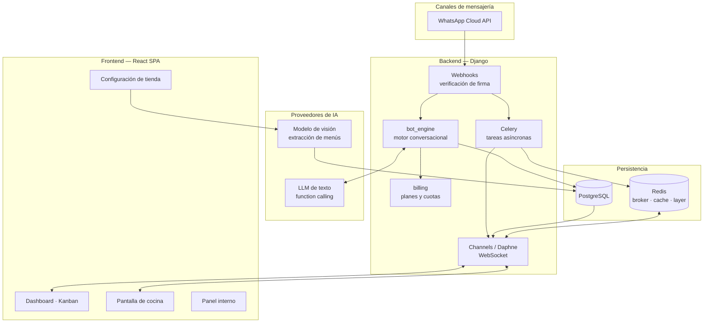

# DILO — Vende por chat. El bot atiende, tú cocinas.

**SaaS de ventas conversacionales por WhatsApp para restaurantes y comercios en LatAm.**

Cada comercio configura su tienda una vez. A partir de ahí un bot de IA atiende
a sus clientes 24/7: muestra el menú, arma el pedido, cobra, verifica el
comprobante de pago y lo manda a la cocina en tiempo real.


---

> ### ⚠️ Sobre este repositorio
>
> Es un **snapshot curado con fines de portafolio**, congelado y sin
> actualizaciones futuras. Se omitieron deliberadamente:
>
> - los **prompts de producción** del motor conversacional y del extractor de menús,
> - la **lógica de orquestación afinada** del bot,
> - los **precios y cupos reales** de los planes,
> - todas las **credenciales**, dominios y datos de clientes.
>
> Lo que queda es la arquitectura: el diseño del sistema, los modelos, la capa
> de tiempo real, la seguridad multi-tenant, los tests y el pipeline de
> despliegue. **El código no es desplegable.** Ver [LICENSE](LICENSE).

---

## El problema

En LatAm, una porción enorme de los restaurantes vende por WhatsApp **a mano**.
Alguien del equipo lee cada mensaje, transcribe el pedido a un papel, dicta el
número de Nequi, espera la foto del comprobante, la verifica a ojo y le grita a
la cocina lo que hay que preparar.

Funciona con cinco pedidos al día. Se cae en hora pico, que es exactamente
cuando más plata hay sobre la mesa. Los síntomas son siempre los mismos:

- mensajes sin responder mientras la cocina está llena,
- pedidos mal transcritos que se devuelven,
- precios dictados de memoria, casi siempre desactualizados,
- clientes que dejaron de pedir y de los que nadie se enteró.

Las alternativas del mercado obligan al comensal a descargar una app o a entrar
a un portal. En la práctica el comensal no quiere una app: quiere escribir por
WhatsApp, como le escribe a cualquier persona.

## La solución

| Para el cliente final | Para el dueño del negocio |
|---|---|
| Escribe al WhatsApp del negocio como a cualquier contacto | Dashboard en tiempo real por WebSocket: Kanban de pedidos, chat y estadísticas |
| El bot conoce el menú real y los precios exactos, y arma el pedido | Pantalla de cocina (KDS) con semáforo de tiempos, pantalla completa y wake-lock |
| Paga por transferencia (foto del comprobante) o por link de pago | Sube su menú **con una foto** — la IA con visión lo estructura y lo carga |
| Recibe confirmación, estado del pedido y seguimiento | Menú digital renderizado como imagen desde la BD: precios jamás alucinados |
| El bot recuerda su nombre y su dirección entre pedidos | Bot entrenable: personalidad, horarios, domicilios y reglas propias |

**Multi-tienda real.** Cada comercio conecta *su* número de WhatsApp mediante
Embedded Signup de Meta. Credenciales cifradas por tienda, aislamiento de datos
por propietario a nivel de queryset y de constraint de BD.

**Monetización integrada.** Planes por conversaciones mensuales (ventana de 24h,
igual que la facturación de Meta), trial automático y enforcement *fail-open*.

---

## Capturas

### Dashboard en tiempo real

Pedidos entrantes en una sola bandeja, con métricas del día y ranking de
productos. El estado se actualiza por WebSocket: sin recargar, sin polling.


### El bot vendiendo

El bot reconoce al cliente recurrente, le propone su pedido anterior y sugiere
el complemento. Los precios salen del catálogo, no del modelo.

<p align="center">
  
</p>

### Configuración del menú

El comercio sube una foto o un PDF de su carta física y la IA con visión
detecta categorías, productos y precios. Antes de crear nada, el dueño revisa
y corrige en un preview — la extracción nunca escribe directo al catálogo.


### Landing


---

## Arquitectura



Detalle completo en [`docs/ARCHITECTURE.md`](docs/ARCHITECTURE.md).

---

## Stack técnico

| Capa | Tecnología |
|---|---|
| **Backend** | Django · Django REST Framework · SimpleJWT |
| **Tiempo real** | Django Channels · Daphne (ASGI) · Redis channel layer |
| **Asincronía** | Celery (worker + beat) sobre Redis |
| **Base de datos** | PostgreSQL en producción · SQLite en desarrollo |
| **IA** | Gateway compatible con OpenAI · function calling · modelo con visión para menús |
| **Frontend** | React 19 · React Router 7 · TailwindCSS · Framer Motion · GSAP · lucide-react |
| **Mensajería** | WhatsApp Business Cloud API (Embedded Signup de Meta) |
| **Infraestructura** | Docker · docker-compose · nginx · GitHub Actions |
| **Observabilidad** | Sentry (opcional, se activa por variable de entorno) |
| **Testing** | pytest · pytest-django · 13 suites |

---

## Decisiones de arquitectura

Esta es la sección que explica *por qué* el sistema está construido así.

### 1. Los precios nunca los escribe el LLM

Un modelo de lenguaje que dicta precios de memoria se equivoca, y en venta real
esa equivocación es plata perdida del comercio. La solución no fue afinar el
prompt hasta que dejara de fallar — fue quitarle la posibilidad.

Cuando el comercio tiene menú cargado, el bot **no transcribe la carta**: llama
a la tool `enviar_menu` y el sistema envía una imagen renderizada con PIL
directamente desde el modelo relacional. El LLM decide *cuándo* mostrar el
menú; nunca decide *qué dice*.

📁 `orders/services/menu_image.py` · `orders/bot_engine.py::_send_menu_image`

### 2. Red de seguridad anti-fraude sobre la salida del modelo

El prompt le prohíbe al bot dictar datos bancarios. Pero una prohibición en el
prompt es una petición, no una garantía: basta un jailbreak o una alucinación
para que el modelo escriba un número de cuenta que no existe — y el cliente
transfiera su dinero a la nada.

Por eso toda respuesta del bot pasa por un filtro que extrae los números que
parecen datos de pago y los coteja contra una allowlist derivada de la
configuración del comercio. Si aparece uno que no está autorizado, el mensaje
se redacta, se sustituye por los datos reales y se registra el incidente.

Defensa en profundidad: el prompt reduce la probabilidad, el filtro elimina la
consecuencia.

📁 `orders/bot_engine.py::_redact_payment_leak`

### 3. Aislamiento multi-tenant en dos capas

Un bug de autorización en un SaaS multi-tenant significa que un restaurante ve
los pedidos de otro. Confiar solo en el filtrado de la aplicación es confiar en
que ningún endpoint futuro olvide un `.filter(owner=request.user)`.

El aislamiento se aplica en dos niveles independientes: filtrado por propietario
en los querysets, **y** constraints a nivel de base de datos que hacen imposible
persistir una relación cruzada entre tiendas. Para filtrar mal hay que
equivocarse en los dos.

📁 `orders/models.py` · `orders/staff_permissions.py`

### 4. Enforcement de facturación *fail-open*

La cuota de conversaciones se verifica en cada mensaje entrante. Pero si esa
verificación lanza una excepción — Redis caído, una migración a medias, un bug
en el cálculo del período — la decisión correcta **no** es bloquear la venta.

Un error de facturación jamás debe costarle un pedido a un comercio. El
enforcement falla hacia abierto: registra, alerta y deja pasar. Se pierde una
conversación facturable; no se pierde la venta de un cliente que no tiene la
culpa de tu bug.

📁 `orders/billing.py`

### 5. Prompt compuesto por capas

El system prompt no es una constante: se construye en cada turno concatenando
capas con precedencia creciente — identidad, contexto del negocio, contexto del
cliente, pedido en curso, menú actual, reglas de venta, reglas anti-invención,
reglas de pago, personalidad y, de último, las instrucciones propias del
comercio.

El orden importa: lo que va al final pesa más en la atención del modelo, y por
eso las reglas del dueño se inyectan al cierre. El menú se re-inyecta en cada
turno sin cachear: si el comercio cambia un precio, el bot lo refleja en el
mensaje siguiente.

📁 `orders/prompts.py` — la arquitectura está documentada; el contenido no.

### 6. El motor no sabe por dónde llegó el mensaje

`bot_engine` recibe texto y devuelve texto. No conoce el transporte: quién
entregó el mensaje y cómo se responde vive en una capa de adaptadores de canal
detrás de una interfaz común, y el `source` del pedido decide cuál se usa al
salir.

Esto no salió de una previsión de producto — salió de una necesidad de
desarrollo. Aprobar un número de WhatsApp Business con Meta toma semanas, y
esperar sentado a esa aprobación habría congelado el desarrollo del motor
conversacional, que es la parte difícil. Con un segundo adaptador de canal
—trivial de implementar contra la misma interfaz— fue posible iterar el bot
contra conversaciones reales desde el primer día.

El beneficio arquitectónico llegó después: probar el motor sin depender de un
proveedor externo, y quedar con la puerta abierta a canales nuevos sin tocar
el núcleo. **En producción el canal es WhatsApp**; el resto es andamiaje de
desarrollo que se quedó porque desacopla.

📁 `orders/services/` · `orders/tasks.py` · `Order.source` en `orders/models.py`

### 7. Credenciales por tienda, no una cuenta central

Cada comercio conecta su propio número vía Embedded Signup de Meta. Sus
credenciales se guardan cifradas y asociadas a su tienda, nunca en una cuenta
compartida de la plataforma. Un comercio que se va se lleva su número; una
credencial comprometida no expone a los demás.

📁 `orders/services/whatsapp_service.py` · migraciones `0005`, `0018`

### 8. Panel interno con impersonation auditada

El equipo de soporte necesita ver lo que ve el comercio para poder ayudarlo.
Eso es, literalmente, un backdoor — así que se construyó como tal, a la vista:
login separado del embudo de comercios, MFA por correo obligatorio,
restricción por dominio de correo, banner permanente durante la suplantación y
registro en bitácora de cada acción.

📁 `orders/staff_views.py` · `orders/services/staff_mfa.py` · `frontend/src/staff/`

---

## Testing

13 suites con pytest cubriendo el núcleo del sistema:

| Suite | Qué protege |
|---|---|
| `test_bot_pure.py` | Lógica del motor conversacional aislada del LLM |
| `test_bot_pause.py` | Pausa del bot y toma de control manual de la conversación |
| `test_billing.py` | Ciclo de vida de suscripción, trial, degradación, cuotas |
| `test_whatsapp_webhook.py` | Verificación de firma e idempotencia del webhook |
| `test_whatsapp_service.py` | Envío de mensajes y manejo de errores de la API |
| `test_whatsapp_onboarding.py` | Flujo de Embedded Signup |
| `test_staff_login.py` | Login del panel interno, MFA, respuestas indistinguibles |
| `test_staffaccount_command.py` | Comando de creación de cuentas de equipo |
| `test_account_flows.py` | Registro, reset de contraseña, cambio de correo |
| `test_data_deletion.py` | Borrado de datos (cumplimiento Meta / habeas data) |
| `test_reports.py` | Reportes de ventas y exportación |
| `test_emails.py` | Renderizado de las plantillas transaccionales |
| `test_api.py` | Contratos de la API REST |

El CI además corre un **migration drift guard**: falla si los modelos y las
migraciones se desincronizan, que es el error que solo aparece en producción.

```bash
pytest
```

---

## Estado del proyecto

En producción con comercios piloto en Bucaramanga, Colombia. El desarrollo
activo continúa en un repositorio privado.

**Este repositorio es un snapshot congelado** tomado para mostrar el trabajo.
No recibe actualizaciones y no refleja el estado actual del producto.

---

## Licencia

Todos los derechos reservados. Se concede permiso únicamente para **leer y
evaluar** el código con fines de revisión técnica. Cualquier uso, copia,
modificación o redistribución requiere autorización previa y por escrito.

Ver [LICENSE](LICENSE) para el texto completo.

---

<sub>Construido por Luis Mellizo · Bucaramanga, Colombia</sub>
