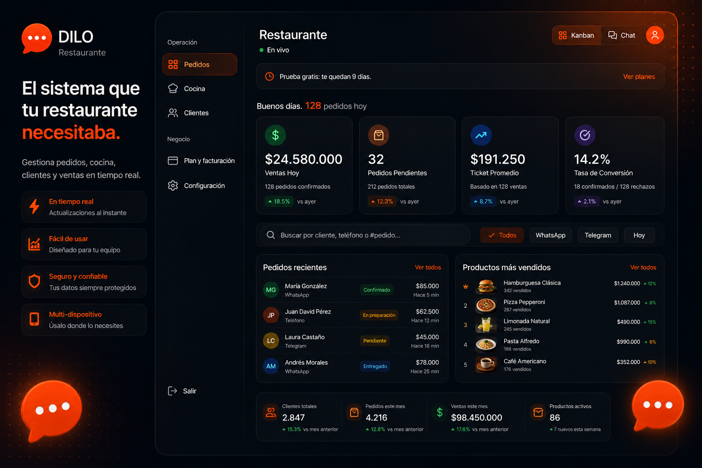
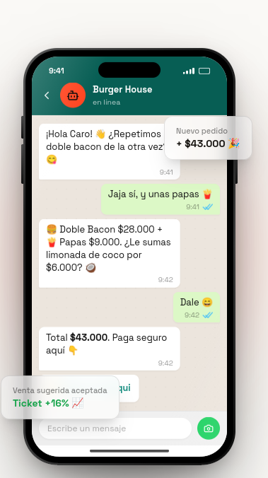
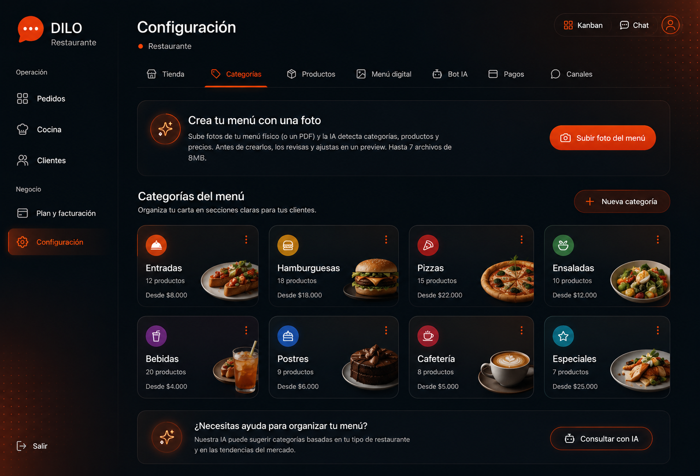
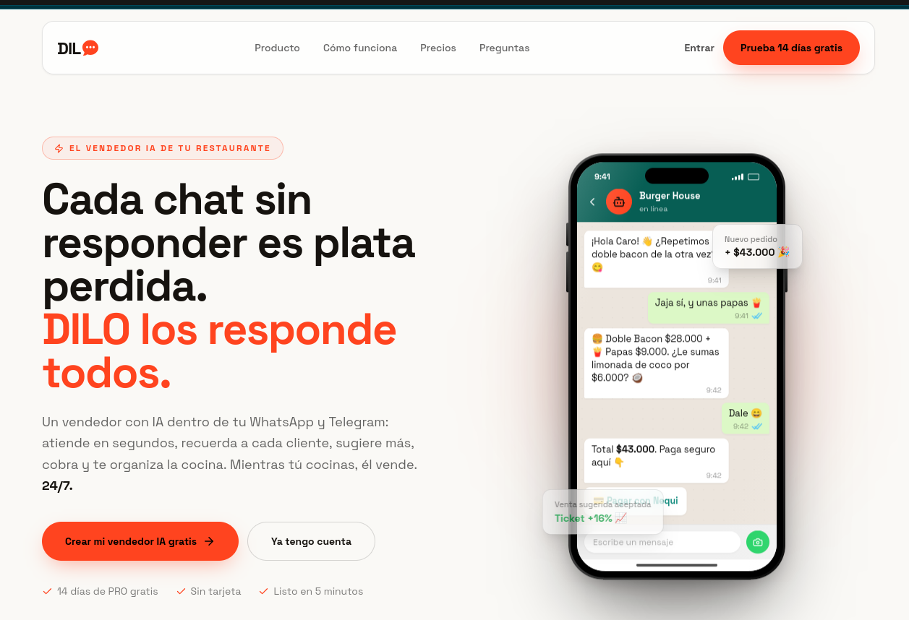

# DILO — Sell over chat. The bot takes orders, you cook.

**Conversational commerce SaaS over WhatsApp for restaurants and small merchants
in Latin America.**

Each merchant sets up their store once. From then on an AI bot serves their
customers 24/7: shows the menu, builds the order, takes payment, verifies the
transfer receipt and drops it in the kitchen in real time.


---

> ### ⚠️ About this repository
>
> A **curated portfolio snapshot**, frozen and unmaintained. Deliberately left
> out:
>
> - the **production prompts** of the conversational engine and the menu extractor,
> - the **tuned orchestration logic** of the bot,
> - the **real pricing and quotas** of the plans,
> - all **credentials**, domains and customer data.
>
> What remains is the architecture: the system design, the models, the real-time
> layer, multi-tenant security, the tests and the deployment pipeline.
> **The code is not deployable.** See [LICENSE](LICENSE).

---

## The problem

In Latin America, a huge share of restaurants sell over WhatsApp **by hand**.
Someone on the team reads every message, copies the order onto paper, dictates
the bank transfer number, waits for a photo of the receipt, eyeballs it, and
shouts into the kitchen what needs cooking.

It works at five orders a day. It collapses at peak hour — which is exactly when
the most money is on the table. The symptoms are always the same:

- messages left unanswered while the kitchen is full,
- mis-transcribed orders that come back,
- prices dictated from memory, almost always out of date,
- customers who stopped ordering and nobody noticed.

The alternatives on the market force the diner to download an app or open a
portal. In practice the diner doesn't want an app: they want to type on WhatsApp,
the way they text anyone else.

## The solution

| For the end customer | For the business owner |
|---|---|
| Texts the business's WhatsApp like any other contact | Real-time dashboard over WebSocket: order Kanban, chat and stats |
| The bot knows the real menu and exact prices, and builds the order | Kitchen display (KDS) with a timing traffic light, fullscreen and wake-lock |
| Pays by transfer (photo of the receipt) or by payment link | Uploads the menu **from a photo** — vision AI structures and loads it |
| Gets confirmation, order status and tracking | Digital menu rendered as an image from the database: prices never hallucinated |
| The bot remembers their name and address between orders | Trainable bot: personality, hours, delivery rules of their own |

**Real multi-store.** Each merchant connects *their own* WhatsApp number through
Meta's Embedded Signup. Per-store encrypted credentials, data isolation by owner
at both the queryset and the database-constraint level.

**Built-in monetization.** Plans by monthly conversations (24-hour window, same
as Meta's billing), automatic trial and *fail-open* enforcement.

---

## Screenshots

### Real-time dashboard

Incoming orders in a single inbox, with the day's metrics and a product ranking.
State updates over WebSocket: no reloads, no polling.



### The bot selling

The bot recognizes a returning customer, offers their previous order and suggests
the add-on. Prices come from the catalog, not from the model.

<p align="center">
  
</p>

### Menu setup

The merchant uploads a photo or a PDF of their physical menu and vision AI
detects categories, products and prices. Before anything is created, the owner
reviews and corrects it in a preview — extraction never writes straight to the
catalog.



### Landing



---

## Architecture


Full detail in [`docs/ARCHITECTURE.md`](docs/ARCHITECTURE.md).

---

## Stack

| Layer | Technology |
|---|---|
| **Backend** | Django · Django REST Framework · SimpleJWT |
| **Real time** | Django Channels · Daphne (ASGI) · Redis channel layer |
| **Async** | Celery (worker + beat) over Redis |
| **Database** | PostgreSQL in production · SQLite in development |
| **AI** | OpenAI-compatible gateway · function calling · vision model for menus |
| **Frontend** | React 19 · React Router 7 · TailwindCSS · Framer Motion · GSAP · lucide-react |
| **Messaging** | WhatsApp Business Cloud API (Meta Embedded Signup) |
| **Infrastructure** | Docker · docker-compose · nginx · GitHub Actions |
| **Observability** | Sentry (optional, enabled by environment variable) |
| **Testing** | pytest · pytest-django · 13 suites |

---

## Architecture decisions

This is the section that explains *why* the system is built this way.

### 1. The LLM never writes prices

A language model that dictates prices from memory gets them wrong, and in real
sales that mistake is money out of the merchant's pocket. The fix wasn't tuning
the prompt until it stopped failing — it was removing the possibility.

When the merchant has a menu loaded, the bot **doesn't transcribe the carte**: it
calls the `enviar_menu` tool and the system sends an image rendered with PIL
straight from the relational model. The LLM decides *when* to show the menu; it
never decides *what it says*.

📁 `orders/services/menu_image.py` · `orders/bot_engine.py::_send_menu_image`

### 2. An anti-fraud safety net over the model's output

The prompt forbids the bot from dictating banking details. But a prohibition in a
prompt is a request, not a guarantee: one jailbreak or one hallucination is
enough for the model to write an account number that doesn't exist — and for the
customer to transfer their money into the void.

So every bot response passes through a filter that extracts numbers that look
like payment details and checks them against an allowlist derived from the
merchant's configuration. If an unauthorized one appears, the message is
redacted, replaced with the real details, and the incident is logged.

Defense in depth: the prompt reduces the probability, the filter removes the
consequence.

📁 `orders/bot_engine.py::_redact_payment_leak`

### 3. Multi-tenant isolation, and what actually guarantees it

An authorization bug in a multi-tenant SaaS means one restaurant sees another
one's orders. That isn't a UX bug: it's a data leak between customers who compete
with each other.

Isolation is enforced **at the application layer**, filtering from the relation
toward the authenticated owner, with the same pattern across every queryset:

```python
Product.objects.filter(category__store__owner=self.request.user)
Order.objects.filter(store__owner=self.request.user)
```

Writes additionally verify ownership explicitly: a `POST` referencing someone
else's `store_id` isn't covered by the read queryset.

The database contributes a **different** layer, not a redundant one: uniqueness
is scoped per store (`unique_together = ['store', 'name']`,
`['store', 'channel_id', 'channel_type']`). That answers a modeling question, not
an authorization one: the same WhatsApp number ordering from two restaurants is
**two distinct customers**, with histories that never cross. A merchant cannot
see what their customer ordered elsewhere.

And a partial constraint covering a different problem — webhook idempotency:

```python
models.UniqueConstraint(
    fields=['platform', 'external_id'],
    condition=models.Q(external_id__isnull=False),
    name='unique_platform_external_id',
)
```

Meta retries any webhook that doesn't answer fast. The duplicate fails in the
database engine, not in an `if` somebody can forget.

**Known limit:** the isolation guarantee lives in the application. It's
consistent and covered by tests, but it isn't structural — a future endpoint that
forgets to filter would open a hole. Moving that guarantee into the engine
(Postgres RLS, or a default manager that forces the filter) is the natural next
step if the team grew.

📁 `orders/views.py` · `orders/models.py` · `orders/staff_permissions.py`

### 4. *Fail-open* billing enforcement

The conversation quota is checked on every inbound message. But if that check
throws — Redis down, a half-applied migration, a bug in the period calculation —
the correct decision is **not** to block the sale.

A billing error must never cost a merchant an order. Enforcement fails open: it
logs, alerts, and lets the message through. You lose one billable conversation;
you don't lose the sale of a customer who isn't at fault for your bug.

📁 `orders/billing.py`

### 5. A prompt composed in layers

The system prompt isn't a constant: it's assembled on every turn by concatenating
layers of increasing precedence — identity, business context, customer context,
in-flight order, current menu, sales rules, anti-invention rules, payment rules,
personality, and last of all the merchant's own instructions.

Order matters: what goes last weighs more in the model's attention, which is why
the owner's rules are injected at the close. The menu is re-injected every turn
without caching: if the merchant changes a price, the bot reflects it in the next
message.

📁 `orders/prompts.py` — the architecture is documented; the content is not.

### 6. The engine doesn't know how the message arrived

`bot_engine` takes text and returns text. It knows nothing about transport: who
delivered the message and how to reply lives in a layer of channel adapters
behind a common interface, and the order's `source` decides which one is used on
the way out.

This didn't come from product foresight — it came from a development need.
Getting a WhatsApp Business number approved by Meta takes weeks, and sitting on
our hands waiting would have frozen work on the conversational engine, which is
the hard part. With a second channel adapter — trivial to implement against the
same interface — it was possible to iterate the bot against real conversations
from day one.

The architectural benefit arrived afterwards: testing the engine without
depending on an external provider, and leaving the door open to new channels
without touching the core. **In production the channel is WhatsApp**; the rest is
development scaffolding that stayed because it decouples.

📁 `orders/services/` · `orders/tasks.py` · `Order.source` in `orders/models.py`

### 7. Per-store credentials, not one central account

Each merchant connects their own number via Meta's Embedded Signup. Their
credentials are stored encrypted and tied to their store, never in a shared
platform account. A merchant who leaves takes their number with them; one
compromised credential doesn't expose the others.

📁 `orders/services/whatsapp_service.py` · migrations `0005`, `0018`

### 8. Internal panel with audited impersonation

The support team needs to see what the merchant sees in order to help them. That
is, literally, a backdoor — so it was built as one, in plain sight: login
separate from the merchant funnel, mandatory email MFA, email-domain restriction,
a permanent banner during impersonation, and an audit log entry for every action.

📁 `orders/staff_views.py` · `orders/services/staff_mfa.py` · `frontend/src/staff/`

---

## Testing

13 pytest suites covering the core of the system:

| Suite | What it protects |
|---|---|
| `test_bot_pure.py` | Conversational engine logic, isolated from the LLM |
| `test_bot_pause.py` | Pausing the bot and taking over the conversation manually |
| `test_billing.py` | Subscription lifecycle, trial, downgrade, quotas |
| `test_whatsapp_webhook.py` | Webhook signature verification and idempotency |
| `test_whatsapp_service.py` | Message sending and API error handling |
| `test_whatsapp_onboarding.py` | Embedded Signup flow |
| `test_staff_login.py` | Internal panel login, MFA, indistinguishable responses |
| `test_staffaccount_command.py` | Team account creation command |
| `test_account_flows.py` | Signup, password reset, email change |
| `test_data_deletion.py` | Data deletion (Meta compliance / habeas data) |
| `test_reports.py` | Sales reports and export |
| `test_emails.py` | Rendering of the transactional templates |
| `test_api.py` | REST API contracts |

CI also runs a **migration drift guard**: it fails if models and migrations fall
out of sync, which is the error that otherwise only shows up in production.

```bash
pytest
```

---

## Project status

In production with pilot merchants in Bucaramanga, Colombia. Active development
continues in a private repository.

**This repository is a frozen snapshot** taken to show the work. It receives no
updates and does not reflect the current state of the product.

---

## License

All rights reserved. Permission is granted solely to **read and evaluate** the
code for technical review. Any use, copying, modification or redistribution
requires prior written authorization.

See [LICENSE](LICENSE) for the full text.

---

<sub>Built by Luis Mellizo · Bogotá, Colombia</sub>
<br><sub>Code comments and inline documentation are in Spanish — the product serves a Spanish-speaking market.</sub>
