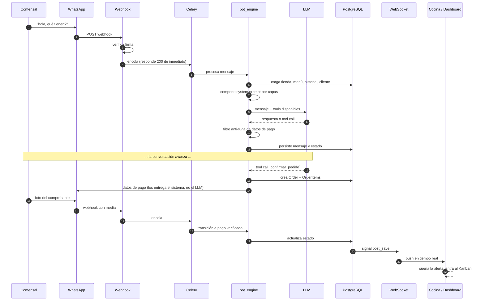
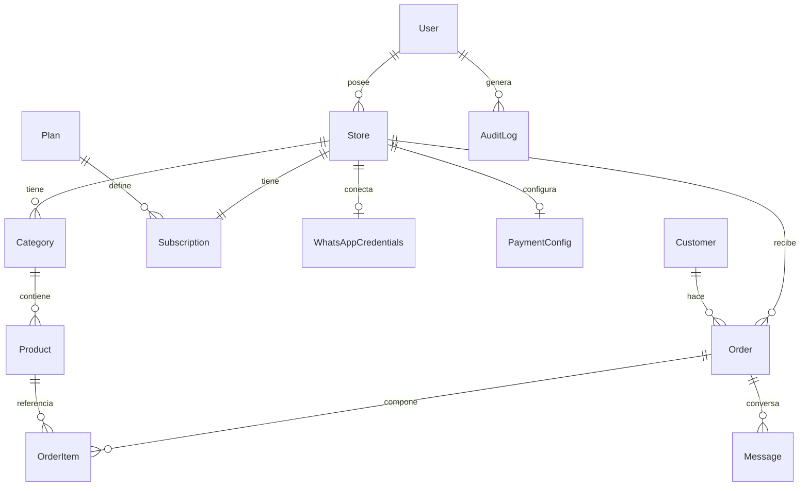
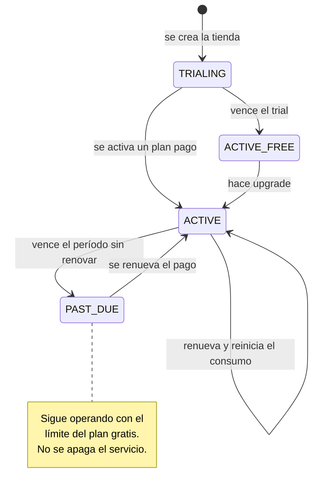
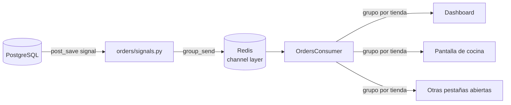
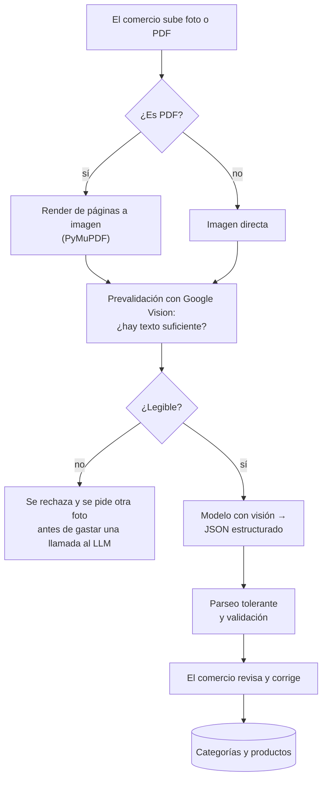
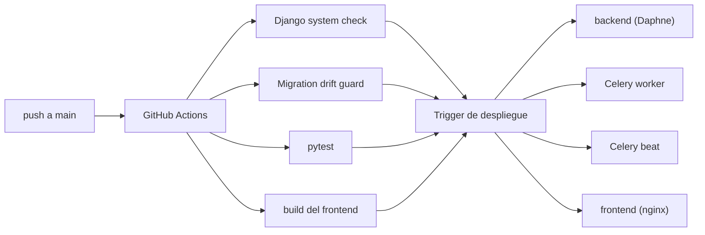

# Arquitectura

Documento de apoyo del [README](../README.md). Describe cómo está organizado el
sistema y por qué.

> Recordatorio: este repositorio es un snapshot parcial. Los prompts de
> producción y la orquestación afinada del motor conversacional no están
> incluidos.

---

## 1. Ciclo de vida de un pedido

Desde que el comensal escribe hasta que la cocina lo ve en pantalla.

**Por qué el webhook responde antes de procesar.** Meta reintenta cualquier
webhook que no conteste rápido. Procesar el mensaje en línea significa timeouts
y mensajes duplicados en horas pico. El webhook solo verifica la firma, encola y
devuelve 200; el trabajo real ocurre en Celery.

---

## 2. Modelo de datos

Decisiones que valen la pena señalar:

- **`OrderItem` guarda un snapshot del nombre del producto.** Si el comercio
  renombra o borra un producto, los pedidos históricos siguen siendo legibles.
  Un reporte de ventas del mes pasado no puede depender del catálogo de hoy.
- **`Customer` es por tienda, no global.** El mismo número de teléfono en dos
  comercios distintos son dos clientes distintos, con historiales que jamás se
  cruzan.
- **Credenciales en tablas propias**, no como columnas de `Store`: permite
  cifrado por campo y que un comercio exista sin canal conectado.
- **`AuditLog` es append-only.** Registra la actividad del panel interno; su
  valor depende de que nadie pueda editarlo.

---

## 3. Suscripciones y cuotas

**Unidad de cobro: la conversación.** Una ventana de 24 horas por cliente, la
misma que usa Meta para facturar. Se eligió así porque es también la unidad de
costo del LLM: el precio del plan queda anclado al gasto que genera, en vez de
a una métrica que no se correlaciona con el costo (mensajes, pedidos, usuarios).

**El enforcement falla hacia abierto.** Si la verificación de cuota lanza una
excepción, se registra y se deja pasar el mensaje. Un error interno de
facturación no puede costarle una venta a un comercio.

📁 `orders/billing.py` · `orders/migrations/0013_seed_plans.py`

---

## 4. Capa de tiempo real

- Un **grupo de Channels por tienda**: el aislamiento multi-tenant se mantiene
  también en el canal de tiempo real, no solo en la API REST.
- La autenticación del WebSocket va por **JWT en el handshake**
  (`orders/channels_auth.py`), no por sesión de Django.
- El frontend usa `react-use-websocket` con reconexión automática y un
  indicador de estado visible (`ConnectionStatus.js`): en una cocina, un socket
  caído en silencio es peor que un error a la vista.

---

## 5. Digitalización del menú desde una foto

El onboarding más frágil de un SaaS de restaurantes es pedirle al dueño que
escriba su menú producto por producto. Casi nadie termina ese formulario.

**Por qué la prevalidación existe.** Una llamada a un modelo con visión cuesta
y tarda. Una foto borrosa, oscura o que ni siquiera es un menú va a fallar de
todos modos — pero falla *cara* y *lenta*, y el dueño se queda mirando un
spinner para recibir un error. Google Vision responde en milisegundos y por
centavos: si no encuentra texto suficiente, se corta ahí y se pide otra foto.

**El resultado siempre pasa por revisión humana.** La extracción no escribe
directo al catálogo: el comercio ve lo que se detectó y lo corrige antes de
guardar. Un precio mal leído que entra al menú sin supervisión se convierte en
una venta a pérdida.

📁 `orders/services/menu_extractor.py`

---

## 6. Seguridad

| Superficie | Medida |
|---|---|
| API pública | JWT con rotación y blacklist tras rotación |
| Webhooks | Verificación de firma; endpoints exentos de autenticación pero validados criptográficamente |
| Multi-tenant | Filtrado por propietario en queryset + constraints de BD |
| Panel interno | Login separado, MFA por correo, restricción por dominio, throttle agresivo (5/min por IP) |
| Impersonation | Banner permanente + registro en `AuditLog` de cada acción |
| Respuestas del LLM | Filtro anti-fuga de datos de pago con allowlist por comercio |
| Credenciales de tienda | Cifradas y aisladas por tienda |
| Producción | HSTS, cookies seguras, `SECURE_PROXY_SSL_HEADER`, redirección SSL |
| Datos personales | Flujo de borrado de datos (cumplimiento Meta / habeas data) |

**Los mensajes de error del panel interno son deliberadamente indistinguibles.**
El paso 1 del login devuelve un 401 idéntico para "correo no existe",
"contraseña incorrecta" y "dominio no autorizado". Un atacante con una lista de
correos no debe poder averiguar cuáles pertenecen al equipo.

---

## 7. Despliegue

**Una sola imagen, cuatro roles.** El mismo `Dockerfile` sirve para Daphne, el
worker y el beat; la variable `CONTAINER_ROLE` decide qué arranca. Menos
imágenes que construir y ninguna posibilidad de que el worker corra una versión
distinta del código que el servidor web.

**Un push redespliega los cuatro servicios.** Antes solo se disparaba el
backend y el frontend seguía sirviendo el bundle viejo. Un despliegue parcial es
peor que ninguno: la SPA queda hablando con una API que ya cambió de contrato.

**Migration drift guard.** El CI falla si los modelos y las migraciones se
desincronizan. Es el error que no aparece en local y sí en producción, a mitad
de un despliegue.
